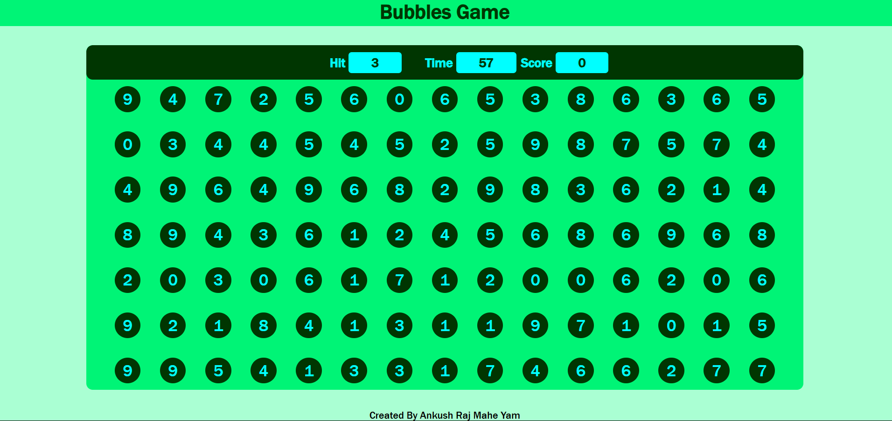

# Bubble-Game

Welcome to Bubble-Game! This web-based game is designed to be user-friendly and enjoyable, featuring HTML, CSS, and JavaScript.

## Function and Features

- Random button-numbers are displayed in the banner tab screen.
- Clicking on the mentioned or displayed number in the banner tab increases the score.
- Incorrect clicks result in a score decrease.
- The game includes a timer to add excitement and challenge.

## Usage

To play the game, simply open the index.html file in your web browser.

## About Me  

Hi, I’m **Ankush Raj Mahe Yam (ARMY)**, an aspiring software developer. I’m passionate about coding and enjoy sharing my learning journey to help others grow.  

🌟 Connect with me:  
- **Google Search:** [Ankush Raj Mahe Yam](https://www.google.com/search?q=ankush+raj+mahe+yam)  
- **LinkedIn:** [Ankush Raj Mahe Yam](https://linkedin.com/in/ankushrajmaheyam)  
- **GitHub:** [Ankush Raj Mahe Yam](https://github.com/AnkushRajMaheYam)  
- **Instagram:** [@AnkushRajaMaheYam](https://instagram.com/AnkushRajaMaheYam)  
- **Facebook:** [Ankush Raj Mahe Yam](https://facebook.com/AnkushRajMaheYam)  

---

## Credits

All rights reserved by [Ankush Raj Mahe Yam (ARMY)](https://github.com/AnkushRajMaheYam).

## License

This project is licensed under the MIT License - see the [LICENSE.md](LICENSE.md) file for details.
